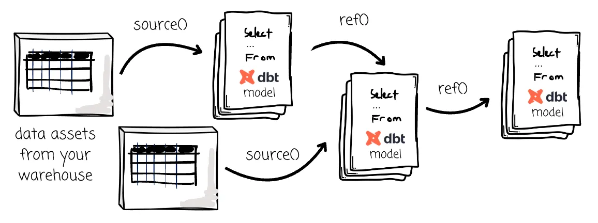

# Self: DBT

Self Sandbox that implement with the best practice of DBT project.

> [!NOTE]
> I will implement `duckdb` and `dbt` with [`dbt-duckdb`](https://github.com/duckdb/dbt-duckdb)
> package.



> [!NOTE]
> It's not an engine like Spark; it's not a database like Postgres or Snowflake;
> it's a tool that helps you manage your SQL data transformation.

## Prerequisite

```shell
dbt init lakehouse --profiles-dir . --project-dir .
cd lakehouse
dbt run
```

```shell
dbt build --project-dir ./lakehouse --profiles-dir ./lakehouse
```